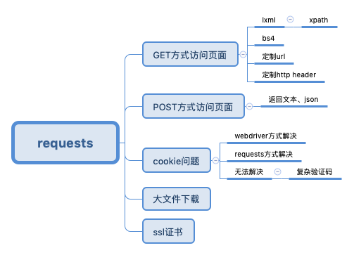

# 2020.03.05 第二讲：简单爬虫

## 序

### pythonic

变量交换：

```python
a, b = b, a
a, b = x, y for ...
```

使用列表推导式：

```python
a_list = [x for in list]
```

列表遍历：

```python
lenth = len(a_list)
i=0
while i < lenth:
    do_th_with(a_list[i])
    i += 1

for i in a_list:
    do_th_with(i)
```

debug调试：

```python
def a():
    return b()

def b():
    return c()

def c():
    return d()

def d():
    x = 0
    return 100/x        # 注意：看调试步骤，会返回到哪

a（）
```

### 虚拟环境

常用：

- virtual env
- venv

创建虚拟环境并迁移第三方包：

```sh
pip3 freeze # 获取有哪些第三方包
pip3 freeze  > requirements.txt    # 将已安装第三方包列表导出到文件
python3 -m venv venv1              # 创建虚拟环境，-m 使用 venv 模块，虚拟环境名称 venv1
source venv/bin/activate           # 进入虚拟环境
pip install -r requirements.txt    # 按照之前的列表安装第三方包
pip isntall --upgrade pip          # 对 pip 进行升级
```

vscode 右下角选择不同的环境即可。

创建虚拟环境不带 pip，在虚拟环境中安装 pip：

```sh
python3 -m venv --without-pip test_env  # 创建虚拟环境，不带 pip
source testvenv/bin/activate            # 进入虚拟环境
python3 -m ensurepip --upgrade          # 强制安装一个新版本的 pip
```

## 本节学习目标

1. 掌握编写爬虫需要掌握的 HTTP、HTML 基础知识
2. 掌握 Requests 库的用法
3. 掌握 Xpath 的用法

## 编写爬虫需要掌握的 HTTP、HTML 基础知识

### TCP/IP 协议简介

了解TCP/IP 协议栈，是 ip 层被封（白页），还是 http 层被封（要求登录），爬虫在不同协议栈发生的问题，有不同的解决办法。

TCP SERVER CLIENT 演示

### HTTP 协议

HTTP 请求的过程

HTTP 请求方式：

登录是怎么实现的

HTTP 状态码（响应代码）

### HTTP 协议与 HTML 的关系

- W3C 标准
- HTML 常用的标签和属性
- 网页的三大组成部分：结构、表现(CSS等)、行为

爬取网页实际上是爬取网页的结构

### HTML

不是编程语言，是一套标记，使用标记来描述网页的结构。

### CSS

层叠样式表

### JavaScript

轻量级脚本语言，由浏览器进行解释执行

### JSON

JavaScript 对象表示方法（JavaScript Object Notation）

### Xpath

七种类型的节点：元素、属性、文本、命名空间、处理指令、注释以及文档（根）节点

节点之间的关系：

- 父（Parent）
- 子（Child）
- 同胞（Sibling）
- 先辈（Ancestor）
- 后代（Descendant）

Xpath 是沿着路径来选取节点的，Xpath 路径表达式如下：

- nodeName：节点下所有的子节点
- `/`：从根位置开始选取
- `//`：从任意位置选取
- `.`：当前节点
- `..`：当前节点的父节点
- `@`：选取属性

Xpath 谓语（用来查找某个特定的节点或者包含某个指定的值的节点。），谓语被嵌在方括号中：

- 第一个元素：`/root/path/to/node[1]`
- 最后一个元素：`node[last()]`
- 倒数第2个元素：`node[last()-1]`
- 选择属性：`//nodep[@name]、//nodep[@name='value']、//nodep[@name>100]`
- 可以使用通配符：`*` 和 `|`

例子：

`//div[@class='article']//div[@class='author']`

`//*[@class='article']`

## urllib、Requests 库的深入讲解

### urllib

历史上出现的 urllib、urllib2、urllib3 库的区别和联系：

- Python2 中，urllib 和 urllib2 是 python 的标准库，urllib2 是 urllib 的增强版
- Python3 中，urllib2 合并到 urllib 中
- urllib3 提供现场安全连接池的文件 post 支持

### Requests

- Requests 基于 urllib3 开发
- Request：HTTP for Humans
- 简单且强大



Requests 库实现 HTTP 协议的常见操作

get：

```python
import requests

r = requests.get('https://api.github.com/evens')
r.status_code
r.headers['content-type']
r.encoding
# r.text
r.json()


# 传递 url
payload = {'key1': 'value1', 'key2': 'value2'}
r = requests.get("http://httpbin.org/get", params= payload)
print(r.url)
```

header：

```python
# 定制请求头部
header = {'user-agent': 'safari'}
r = requests.get("http://httpbin.org/get", headers=header)
print(r.request.headers)
```

post：

```python
import requests
r = requests.post('http://httpbin.org/post', data = {'key': 'value'})
print(r.json())
```

json:

```python
iimport requests
r = requests.post('http://httpbin.org/post', data = {'key':'value'})
r.json()


import json
python_string = {
   'name' : 'value',
   'name2' : 'value2',
   'name3' : 'value3'
}
json_string = json.dumps(python_string)
python_string2 = json.loads(json_string)
```

session：

```python
import requests

s = requests.Session()

s.get('http://httpbin.org/cookies/set/sessioncookie/123456789')
r = s.get("http://httpbin.org/cookies")

print(r.text) # '{"cookies": {"sessioncookie": "123456789"}}'


# 会话还可以用作前后文管理器：
with requests.Session() as s:
    s.get('http://httpbin.org/cookies/set/sessioncookie/123456789')
```

cookie：

```python
"""
requests 方式
"""
import time
import requests
from fake_useragent import UserAgent

ua = UserAgent(verify_ssl=False)
headers = {
'User-Agent' : ua.random
}

s = requests.Session()
# 会话对象：在同一个 Session 实例发出的所有请求之间保持 cookie， 期间使用 urllib3 的 connection pooling 功能。向同一主机发送多个请求，底层的 TCP 连接将会被重用，从而带来显著的性能提升。
login_url = 'https://accounts.douban.com/j/mobile/login/basic'
form_data = {
'ck':'',
'name':'15055495@qq.com',
'password':'test123test123',
'remember':'false',
'ticket':''
}

response = s.post(login_url, data = form_data, headers = headers)

url2 = 'https://www.douban.com/accounts'
response2 = s.get(url2,headers = headers)
# response3 = newsession.get(url3, headers = headers, cookies = s.cookies)

with open('profile.html','w+') as f:
    f.write(response2.text)
```

```python
"""
webdriver 方式
"""

from selenium import webdriver
import time

try:
    browser = webdriver.Chrome()
    # 需要安装chrome driver
    browser.get('https://www.douban.com')
    time.sleep(1)

    browser.switch_to_frame(browser.find_elements_by_tag_name('iframe')[0])
    btm1 = browser.find_element_by_xpath('/html/body/div[1]/div[1]/ul[1]/li[2]')
    btm1.click()

    browser.find_element_by_xpath('//*[@id="username"]').send_keys('15055495@qq.com')
    browser.find_element_by_id('password').send_keys('test123test123')
    time.sleep(1)
    browser.find_element_by_xpath('//a[contains(@class,"btn-account")]').click()

    cookies = browser.get_cookies() # 获取cookies
    print(cookies)
    time.sleep(3)

except Exception as e:
    print(e)
finally:
    browser.close()
```

Requests 下载文件

```python
# 小文件下载：
import requests
image_url = "https://www.python.org/static/community_logos/python-logo-master-v3-TM.png"
r = requests.get(image_url)
with open("python_logo.png",'wb') as f:
    f.write(r.content)

# 大文件下载：
# 如果文件比较大的话，那么下载下来的文件先放在内存中，内存还是比较有压力的。所以为了防止内存不够用的现象出现，我们要想办法把下载的文件分块写到磁盘中
import requests
file_url = "http://codex.cs.yale.edu/avi/db-book/db4/slide-dir/ch1-2.pdf"
r = requests.get(file_url, stream=True)
with open("python.pdf", "wb") as pdf:
    for chunk in r.iter_content(chunk_size=1024):
        if chunk:
            pdf.write(chunk)
```

SSL:

```python
import requests
# SSL 证书
# 如果你将 verify 设置为 False，Requests 也能忽略对 SSL 证书的验证。
requests.get('https://kennethreitz.org', verify=False)
# <Response [200]>

# 客户端证书
# 你也可以指定一个本地证书用作客户端证书，可以是单个文件（包含密钥和证书）或一个包含两个文件路径的元组：
requests.get('https://kennethreitz.org', cert=('/path/client.cert', '/path/client.key'))
# <Response [200]>
```

### 动态网页与 Selenium 的使用简介

使用 Selenium 来进行模拟登录微博

pip install selenium

下载 Chrome 浏览器的 webdriver 到 Python 的 script 目录下
