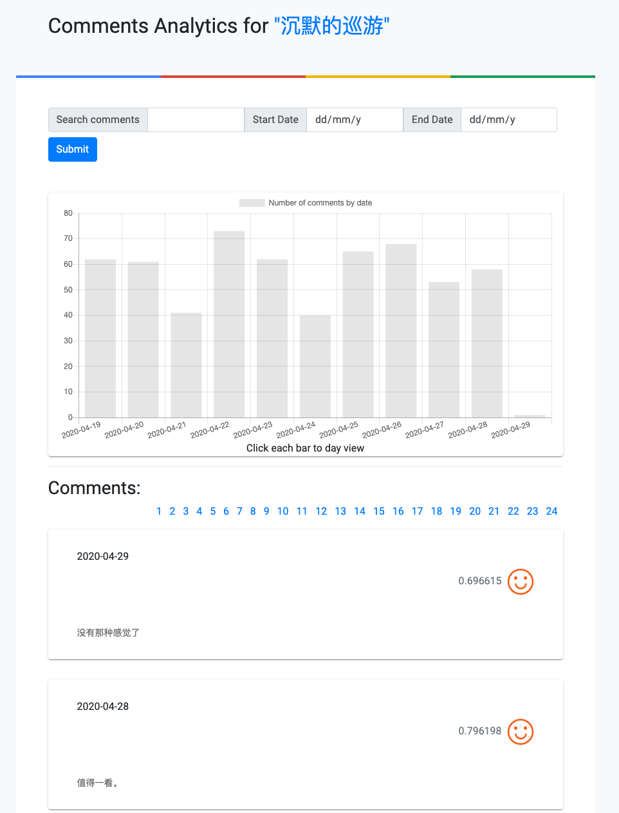
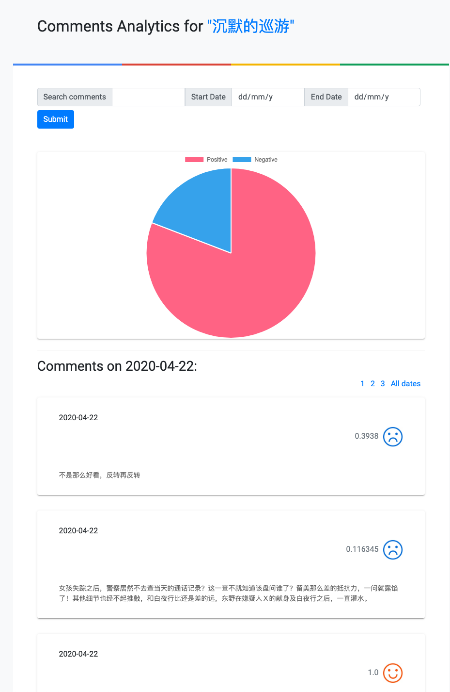
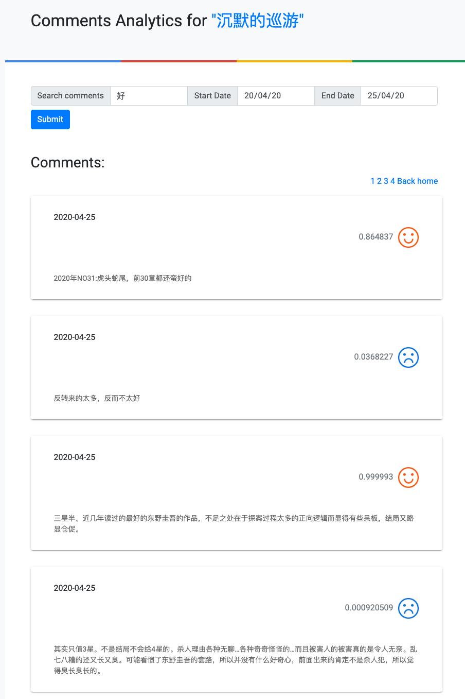

## Week07 Assignment

See [here](https://u.geekbang.org/lesson/8?article=223248) for details of requirements of the task.

The whole task is run in the Kubernetes cluster. The project is managed by [skaffold](https://skaffold.dev/).
You can have build runtime on AWS EKS, GCP(Google Cloud Platform) GKE, local environment, etc.
The task here is run on local environment.

The name of the folders and project may be confusing. The actually source for this task is a douban book instead of a piece of news.
But the project and code base is also adapted to news. 

It's recommended run the application on Chrome browser, it hasn't been tested on other browsers.

### Project Structure

- newscomments: This folder stores the [helm chart](https://helm.sh/docs/topics/charts/), which includes the 
configuration and kubernetes templates.

- src: Include backend, frontend and data. The backend is used to create models, interact with database, and create 
business logic. It provides the APIs for the frontend. The frontend is used to render the web pages, call the backend APIs and implement 
the web logic. The data part is used to collect and manage data from the source. It crawls the web pages to collect the data and store it 
in the database. The default frequency to collect data is 10 seconds (This may be too often. 1 hr could be more reasonable).

- skaffold.yaml: Skaffold configuration file. See [doc](https://skaffold.dev/docs/references/yaml/) here.

Skaffold will create images for backend, frontend and data respectively, and they will talk each other within the Kubernetes cluster.

```
Some of the folders/files are skipped.

root
  |- newscomments
     |- files
        |- initdb.sql
        |- mysqld.cnf
     |- templates
        |- All k8s yaml templates go here
     |- .helmignore
     |- Chart.yaml
     |- values.yaml
  |- src
     |- backend
        |- models
           |- base_model.py
           |- comments.py
           |- news.py
        |- services
           |- newscomments_svc.py
        |- utils
           |- db_helper.py
        |- app.py (backend entrypoint)
        |- Dockerfile
        |- requirements.txt
        |- setup.py
     |- data
        |- datamodels
           |- base_model.py
           |- comments.py
           |- news.py
        |- datautils
           |- db_utils.py
           |- helper.py
        |- newscomments(scrapy project root)
           |- scrapy clawler/spiders/items/pipelines etc.
        |- data_pipeline.py (data entrypoint)
        |- Dockerfile
        |- requirements.txt
        |- setup.py
     |- frontend
        |- static
           |- images, css etc. 
        |- templates
           |- html templates go here
        |- app.py (frontend entrypoint)
        |- Dockerfile
        |- requirements.txt
  |- resources
  |- .gitignore
  |- pylintrc
  |- ReadMe.md
  |- skaffold.yaml
```

### Prerequisites

You need to get below applications installed before kicking off the app.

- [Docker desktop(windows or MacOS)](https://www.docker.com/products/docker-desktop). 
- [Minikube](https://kubernetes.io/docs/tasks/tools/install-minikube/) and [docker(Linux)](https://docs.docker.com/engine/install/)

** Recommend to install docker desktop for Windows or MacOS. If you install docker desktop, make sure you get Kubernetes enabled. 
- [skaffold](https://skaffold.dev/docs/install/)
- [helm3](https://helm.sh/docs/intro/install/)
- [kubectl](https://kubernetes.io/docs/tasks/tools/install-kubectl/)
- [docker hub](https://hub.docker.com/) account or accounts on other popular public container registry which hosts most common images, like [gcr(Google)](https://cloud.google.com/container-registry), [ecr(Amazon)](https://aws.amazon.com/ecr/).
- Python3.7 and pip (Best tested). This is only required if you need to run from IDE without using skaffold.

### Setup and Run

a) Setup local container registry.
```bash
$ docker run -d -p 5000:5000 --name registry registry:2
```
You can have your own port and registry name. Once it's setup, go to 
http://localhost:5000/v2/_catalog to see all your repositories.
If you need to stop and remove it, run
```bash
$ docker stop registry
$ docker rm registry
```
If you prefer using other public registry instead, this step can be skipped.

b) Create new namespace in Kubernetes cluster. This step is recommended to isolate the environment.
```bash
$ kubectl create namespace <your namespace>
```
In my assignment, I created a namespace called 'week07'.

c) Go to the project directory which has skaffold.yaml file. Replace the namespace you created in above step under section 'deploy/helm/releases'.
Also, replace the "container_repo" property under file ./newscomments/values.yaml with your container registry path that the images are pushed to.

In my case, it is "localhost:5000/week07"

d) Run application
```bash
$ skaffold run -d <your container registry path>
```
In my case, it is "localhost:5000/week07". Once it's successfully installed and up running, go to
http://localhost to access the page. In case your port 80 is occupied by other application on your computer,
modify 'frontendPort' property in newscomments/values.yaml file. Likewise, you can update your local host mysql port by modifying 
'mysqlPort' property if it conflicts with your default mysql port.

e) Stop application
```bash
$ skaffold delete
```

### Features

You will see the bar chart in the home page, which displays teh number of comments by date. Below the bar chart, you can see 
the list of comments with details including the sentiment info. You can see pagination on top and bottom of the comments block.
Each page displays 25 items by default.
On top of the page, you will see the search bar that you can search text in the comments with the date ranges.  

By clicking each bar, you will be directed to the day view page. In this page, you will see a pie chart that gives you idea on 
numbers of positive and negative comments. Like the main page, below the pie chart, there is the comments block with the date you pick up.
Also, search bar on top of the pie chart that you can search the comments with the date ranges. 

** Data Collection ** 

For the particular case in this project, it uses the comment id which is crawled from the source. The comment id is integer and unique, so you just need to anchor the max comment id each time before 
you collect new data. Also, you need to clean the data whose comment is missing. You only need to insert into the database for the comments whose comment id are greater than the max one. For the empty database,
the max comment id is 0. But you can still think about using pandas for other purposes.

### Screenshots

- Main page:



- Day page (when you click each bar):



- Search page:
  Search by key words in comments, also support date ranges.




### Troubleshooting

- Monitor all resources under your namespace.
```bash
$ kubectl get all -n <namespace>
```
- Run application as debug or development mode

dev
```bash
$ skaffold dev -d <your container registry path>
``` 
debug
```bash
$ skaffold debug -d <your container registry path>
```
- See logs or describe a particular pod
```bash
$ kubectl logs <pod id> -n <namespace>
```
```bash
$ kubectl describe pod/<pod id> -n <namespace>
```
- Login to particular pod to interact with it
```bash
$ kubectl exec -it <pod id> -n <namespace> -- bash 
```
- You may encounter the situation that mysql fails to initialize the database. If that's the case,
go to the mysql pod by running command below:
```bash
$ kubectl exec -it mysql-0 -n <namespace> -- bash
```
then load initdb.sql to initialize the database.
```bash
$ mysql -uroot -p < ./docker-entrypoint-initdb.d/initdb.sql
```
enter the password, then the database will be initialized.

** You may need to restart the application by stopping and running application again.

### Run and Debug on IDE

I will take [PyCharm](https://www.jetbrains.com/pycharm/) as an example.

a) Install [cloud code](https://cloud.google.com/code) plugin which is also available for VS Code.

b) Load the source code into a new project. You can create a new run configuration to 
run/debug the Cloud Code application. In the configuration, you can input your 
container registry url in 'Image options' section. Then you can run/debug the application like others.

cloud code will keep watching your changes, and automatically sync your changes to containers.

VS Code is quite similar, here is a [quickstart](https://cloud.google.com/code/docs/vscode/quickstart) doc from google cloud.

### To-Do

Due to the time limit, there are a few things that can put into the to-do list in the future.

- Collect data from multiple sources, and classify them.
- Provide different parsing templates and strategies when crawling from different sources. So the code will be more generic.
- The home page will display the collection of sources. By clicking each source, the bar chart view is directed.
- For each source, provide month view against on number of comments.
- The code is still need to be polished and reviewed, as some of them were not well organized, there are still quite a few duplicates in code.
- Make more things to be configurable. Like data collection frequency, items per page, etc.
- Manage and uplift the page templates, employs more MVC web framework together with Flask.
- Make the pagination more intelligent in case there are many pages to navigate.
- Bug fixing. Of course, the whole thing is not 100% well tested, there definitely will be bugs. But most of functions are runnable.
- Train the data with higher accuracy. Currently it just simply uses SnowNLP to analyse the sentiment.
- Other things when they are come up.


